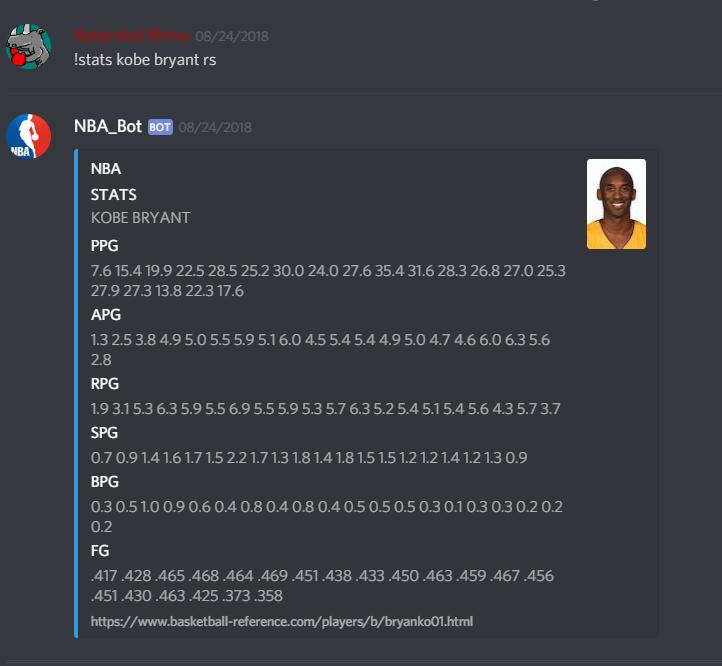
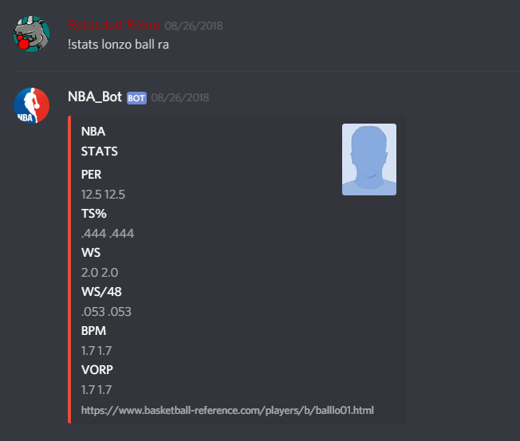
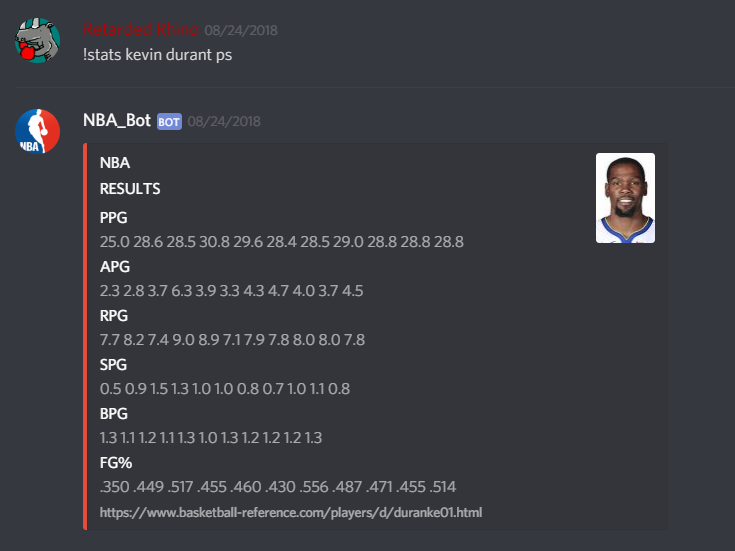
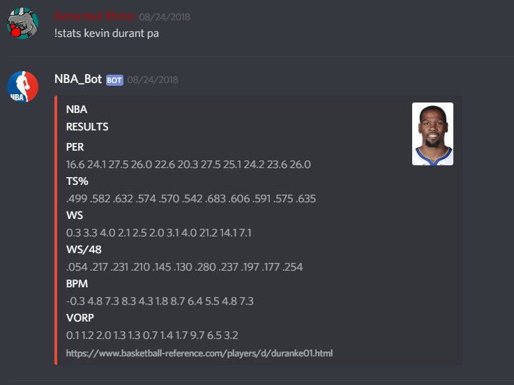
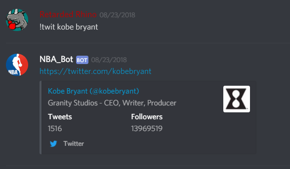
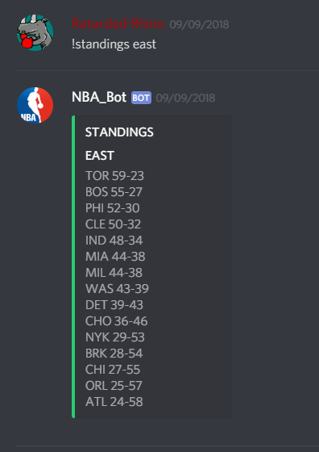
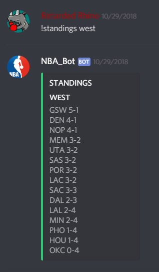
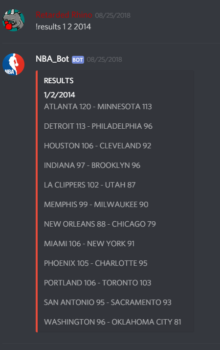

# NBA_Discord_Bot
Easy to use NBA bot in Discord

## Functions

### - !commands - Brings up the available functions for the bots with usage.

### - !stats firstname lastname (type) - Brings up the type of stats of the player mentioned
                                   
  
  
### *type - rs (Regular Season)*

### *type - ra (Regular Season Advanced)*

 

### *type - ps (Post Season)*

### *type - pa (Playoff Advanced)*

### - !twit firstname lastname - Brings up the twitter account of the player if it exists 

### - !standings conference - Brings up the current standings of the mentioned conference

### *conference - east*

### *conference - west*

### - !results date month year - Brings up the results of the games on given data

### - !team teamname - Simply changes your colour on discord in accordance to the team

